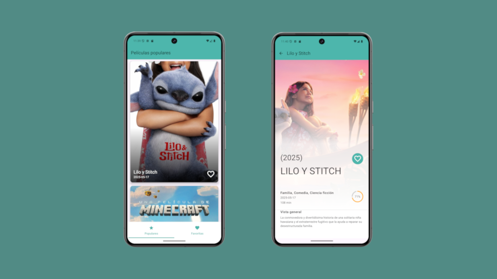

# Movies compose

**Movies compose** es una aplicación desarrollada en `Kotlin` con `Jetpack` (Room, ViewModel, Compose), `corrutinas` y `Material Design` basado en `clean arquitecture` con un modelo de presentación `MVVM`.

---

## Tecnologías y Librerías

  
- Lenguaje: Kotlin
- Framework: Compose
- SDK mínimo: 28
- SDK máximo: 35

---