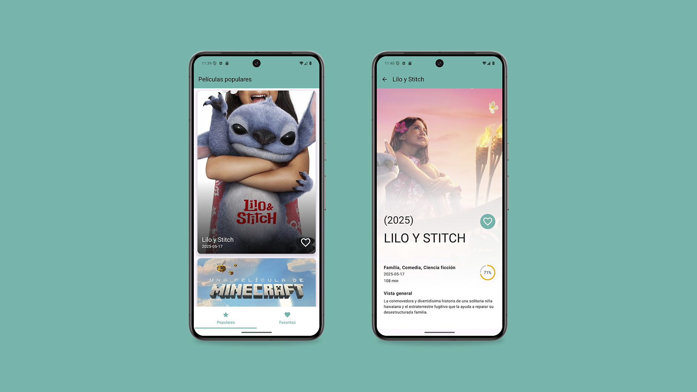

# Movies compose



**Movies compose** es una aplicación desarrollada en `Kotlin` con `Jetpack` (Room, ViewModel, Compose), `corrutinas` y `Material Design` basado en `clean arquitecture` con un modelo de presentación `MVVM`.

---

## Descargar
Ve a [Releases](./app/release) para descargar la última versión de la APK.

## Requisitos
  
- Lenguaje: Kotlin
- Toolkit: Jetpack Android
- SDK mínimo: 28
- SDK máximo: 35

---

## Tecnologías y Librerías

### Librerías y herramientas principales
- **Jetpack Compose**: Toolkit moderno de Android para desarrollar interfaces declarativas de forma rápida y eficiente.
- **Lifecycle**: Gestiona los ciclos de vida de componentes de UI de forma reactiva.
- **ViewModel**: Permite mantener y gestionar datos de UI de manera segura ante cambios de configuración.
- **LiveData**: Observa los datos y permite que la UI reaccione automáticamente a los cambios.
- **Navigation Compose**: Navegación entre pantallas.

### Persistencia de datos
- **Room**: Persistencia en base de datos local sobre SQLite.

### Consumo de API REST
- **Retrofit2** + **OkHttp3**: Cliente HTTP moderno y eficiente para llamadas REST.
- **Gson**: Librería de Google para convertir JSON en objetos Kotlin y viceversa, mediante anotaciones como `@SerializedName`.

### Manejo de datos
- **Coroutines**: Facilita la programación asíncrona y concurrente, permitiendo operaciones de red y base de datos sin bloquear el hilo principal.
- **Paging3**: Carga eficiente de grandes conjuntos de datos en la UI, optimizando el rendimiento y la memoria.

---

## Arquitectura
- **Arquitectura limpia (Clean Architecture)** con enfoque **MVVM (Model - ViewModel - View)**:
  Se ha estructurado el proyecto siguiendo principios de Clean Architecture para mejorar la mantenibilidad, testabilidad y escalabilidad del código. La lógica de negocio se encuentra desacoplada de la lógica de presentación, permitiendo un desarrollo modular y enfocado a responsabilidades específicas.

### Capa de datos
- **API**: Consumo de datos desde una API REST utilizando Retrofit2 y OkHttp3.
- **Base de datos local**: Persistencia de datos utilizando Room, con entidades y DAOs bien definidos.
- **Repositorios**: Interfaz que define las operaciones de acceso a datos, implementada para interactuar con la API y la base de datos local.

### Capa de presentación
- **ViewModels**: Clases que gestionan la lógica de presentación y exponen datos a la UI, utilizando LiveData para notificar cambios.
- **Composables**: Componentes de UI declarativos construidos con Jetpack Compose, que representan la vista y reaccionan a los cambios en los datos.
- **Screens**: Pantallas de la aplicación que utilizan los composables para mostrar la información al usuario.

---

## Open API
<table style="border-collapse: collapse; border: 0; outline: 0; width: 100%;">
<tr>
<td style="border: 0; outline: 0; width: 60%; vertical-align: top;">
Movies compose utiliza la API <a href="https://www.themoviedb.org/documentation/api">The Movie Database (TMDB)</a> para obtener la información de las películas.
</td>
<td style="border: 0; outline: 0; width: 40%; vertical-align: top;">

</td>
</tr>
</table>

---

## Licencia
Diseñado y desarrollado por AnnaSolox en 2025.

```
Este proyecto está bajo la licencia [Apache 2.0](./LICENSE).
No puedes usar este archivo salvo en cumplimiento con la Licencia.
Puedes obtener una copia de la Licencia en:

https://opensource.org/license/apache-2-0

A menos que lo exija la ley aplicable o se acuerde por escrito,
el software distribuido bajo la Licencia se distribuye "TAL CUAL",
SIN GARANTÍAS NI CONDICIONES DE NINGÚN TIPO, ya sean expresas o implícitas.
Consulta la Licencia para conocer el lenguaje específico
que regula los permisos y limitaciones bajo la Licencia.
```
