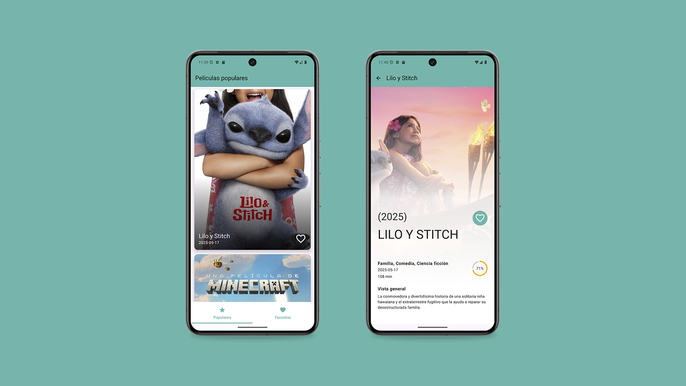

# Movies compose

> [Versión en Español / Spanish version](README_ES.md)

**Movies compose** is an Android application developed in `Kotlin` using `Jetpack` libraries (Room, ViewModel, Compose), `coroutines`, and `Material Design`, following `Clean Architecture` with an `MVVM` presentation model.

---

## Download
Go to [Releases](./app/release) to download the latest APK version.

## Requirements
  
- Language: Kotlin
- Toolkit: Jetpack Android
- Minimum SDK: 28
- Maximum SDK: 35

---

## Technologies and Libraries

### Main libraries and tools
- **Jetpack Compose**: Modern Android toolkit to quickly build efficient declarative UIs.
- **ViewModel**: Safely manages UI-related data and survives configuration changes.
- **LiveData**: Observes data and allows the UI to automatically react to changes.
- **Navigation Compose**: Handles navigation between screens.

### Data persistence
- **Room**: Local database persistence layer on top of SQLite.

### REST API consumption
- **Retrofit2** + **OkHttp3**: Modern, efficient HTTP client for REST calls.
- **Gson**: Google library to convert JSON into Kotlin objects and vice versa, using annotations like `@SerializedName`.

### Data handling
- **Coroutines**: Simplifies asynchronous and concurrent programming, allowing network and database operations without blocking the main thread.
- **Paging3**: Efficiently loads large sets of data into the UI, optimizing performance and memory usage.

---

## Architecture
- **Clean Architecture** with **MVVM (Model - ViewModel - View)** approach:  
  The project is structured following Clean Architecture principles to improve maintainability, testability, and scalability. The business logic is decoupled from the presentation logic, enabling modular development with clearly defined responsibilities.

### Data layer
- **API**: Consumes data from a REST API using Retrofit2 and OkHttp3.
- **Local database**: Stores data using Room with well-defined entities and DAOs.
- **Repositories**: Interface that defines data access operations, implemented to interact with both the API and local database.

### Presentation layer
- **ViewModels**: Classes that manage presentation logic and expose data to the UI, using LiveData to notify changes.
- **Composables**: Declarative UI components built with Jetpack Compose, representing the view and reacting to data changes.
- **Screens**: App screens that use composables to display information to the user.

---

## Open API
<table style="border-collapse: collapse; border: 0; outline: 0; width: 100%;">
<tr>
<td style="border: 0; outline: 0; width: 60%; vertical-align: top;">
Movies Compose uses the <a href="https://www.themoviedb.org/documentation/api">The Movie Database (TMDB)</a> API to retrieve movie information.
</td>
<td style="border: 0; outline: 0; width: 40%; vertical-align: top;">

</td>
</tr>
</table>

---

## License
Designed and developed by AnnaSolox in 2025.

This project is licensed under the [Apache 2.0](./LICENSE).
You may not use this file except in compliance with the License.  
You may obtain a copy of the License at:

https://opensource.org/license/apache-2-0

Unless required by applicable law or agreed to in writing, software distributed under the License is distributed on an “AS IS” BASIS, WITHOUT WARRANTIES OR CONDITIONS OF ANY KIND, either express or implied.  
See the License for the specific language governing permissions and limitations under the License.
